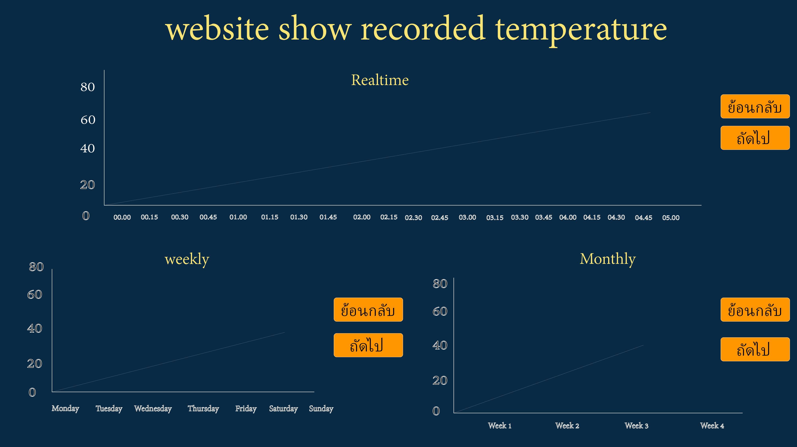

"# web_temperature" 
คำสั่ง git hub

1. git pull // ใช้เมื่อมีใครคนใดคนนึงแก้ไขและอัพgit ขึ้นไป

2. git add . // บันทึกข้อมูล

3. git commit -m "ใส่ข้อความที่แก้ไขลงไป"

4. git push //นำขึ้นไป repository

--------------------------------------------ส่วนขิง ui--------------------------------------------------------------------------------------

